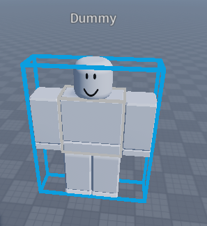
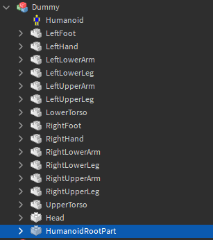
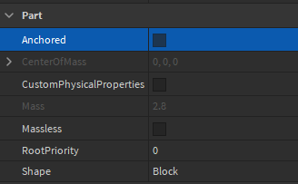

이 예시에서는 플레이어를 계속 따라다니는 NPC를 만들것입니다. 만약 PathfindingModule이 없으시다면 [설치 가이드](../installation)를 참고하세요.

PathfindingModule을 설치한 게임에 NPC를 먼저 만들어 줄것입니다.

``Rig Builder``플러그인에서 ``Block Rig``을 골라 Dummy를 꺼내줍니다

.

그리고 Dummy의 ``HumanoidRootPart``의 ``Anchored``속성을 꺼줍니다

.


Dummy안에 해당 내용으로 작성된 스크립트를 넣어줍니다.

```lua
local ServerStorage = game:GetService("ServerStorage")
local PathfindingModule = require(ServerStorage.PathfindingModule)
local NPC = script.Parent
local MoveHandler = PathfindingModule.new(NPC)

while true do
	MoveHandler:MoveTo()
end
```

완료되었다면 ``"Play"버튼`` 또는 ``F5``를 눌러 게임을 실행시켜봅니다.

만약 Dummy가 케릭터를 계속 쫓아온다면 성공입니다!

